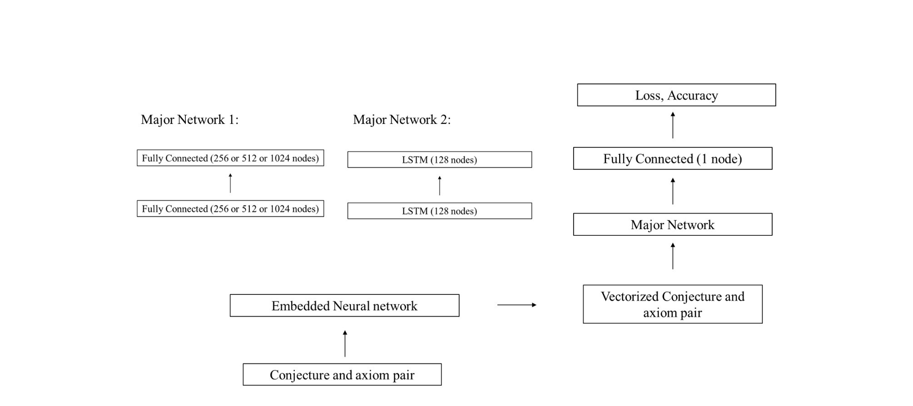
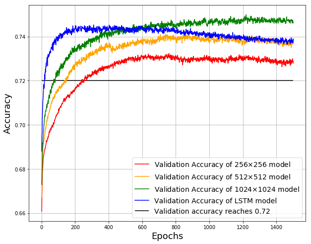

# Positive Bias and Length Bias: How Deep Neural Sequence Differs toHuman Cognition in Premises Selection

## Abstract
We compare here the premises selections of the deepneural sequence models with that of human cognition.We train fully-connected neural networks with differ-ent numbers of hidden units and an LSTM using con-jecture  and  axiom  pairs  from  the  Mizar  Mathemati-cal Library and compare the networks’ performances.We then compare the premises choices for a sample of5 conjecture and axiom pairs from 9 college studentsto  that  of  our  network  model.   We  find  that  the  net-work models tend to classify more premises as neces-sary and predict more accurately with greater number ofpremises, which contrasts with the pattern humans ex-hibits. We propose that the Positive Bias and the LengthBias  makes  the  network  models  distinct  from  humancognition.

## Description
The github repository records the class project "Positive Bias and Length Bias: How Deep Neural Sequence Differs toHuman Cognition in Premises Selection", which needs more human data and examination of up-to-date model to get published. 

## Acknowledgement
Codes for parsing context free grammars and guidancefor formatting and vectorizing the data are provided by Andrzej Kucik on github. We also thanks our instructor of CS328 and advisor Anna Rafferty for all kinds of help she providess

## Models
The models can be found in the experiments folders. The files containing the training the models are prefixxed "Network".

